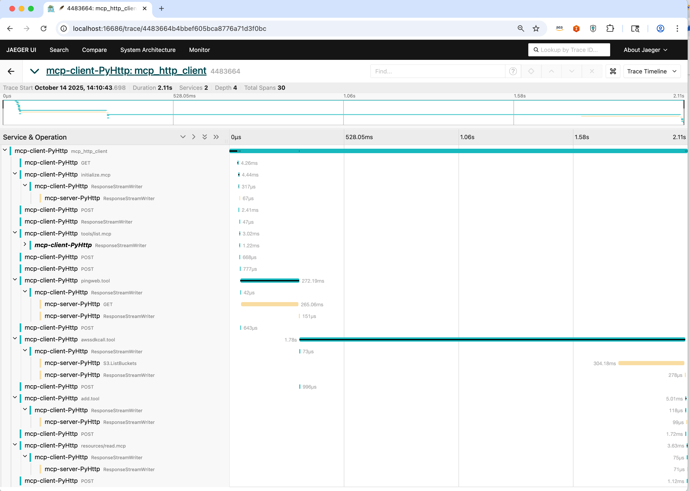

# MCP HTTP Transport Example

This example demonstrates OpenTelemetry instrumentation for MCP using HTTP transport with Server-Sent Events (SSE).

## Running the Server

### 1. Install Dependencies

```bash
cd server
uv sync
uv run opentelemetry-bootstrap -a install

# Install MCP instrumentation library
uv run pip install -e ../../../../opentelemetry-instrumentation-mcp
```

### 2. Start the Server

```bash
cd server

OTEL_SERVICE_NAME=mcp-server-PyHttp \
  OTEL_TRACES_EXPORTER=otlp \
  OTEL_EXPORTER_OTLP_TRACES_ENDPOINT=http://localhost:4317/v1/traces \
  uv run opentelemetry-instrument python ./server.py
```

The server will start on `http://localhost:8000`.

## Running the Client

### 1. Install Dependencies

```bash
cd client
uv sync
uv run opentelemetry-bootstrap -a install

# Install MCP instrumentation library
uv run pip install -e ../../../../opentelemetry-instrumentation-mcp
```

### 2. Run the Client

```bash
cd client

OTEL_SERVICE_NAME=mcp-client-PyHttp \
  OTEL_TRACES_EXPORTER=otlp \
  OTEL_EXPORTER_OTLP_TRACES_ENDPOINT=http://localhost:4317/v1/traces \
  uv run opentelemetry-instrument python ./client.py
```

## Jaeger Trace Visualization




## How It Works

### Transport Layer

- **Server**: Uses `mcp.server.sse` for HTTP transport with Server-Sent Events
- **Client**: Uses `mcp.client.sse.sse_client()` to connect via HTTP
- **Communication**: Real-time bidirectional communication over HTTP/SSE

### Instrumentation

The OpenTelemetry instrumentation automatically:

1. **Traces all MCP operations**: Tool calls, resource reads, prompt handling, and session lifecycle
2. **Injects W3C trace context**: Embeds trace context into MCP message metadata
3. **Propagates context**: Maintains trace continuity across HTTP requests
4. **Links spans**: Creates parent-child relationships between client and server operations

## Transport Comparison

| Feature | stdio Transport | HTTP/SSE Transport |
|---------|----------------|--------------------|
| Communication | Process-based (stdin/stdout) | Network-based (HTTP) |
| Use Case | Local processes | Distributed systems |
| Instrumentation | Fully supported | Fully supported |
| Trace Propagation | W3C trace context | W3C trace context |
