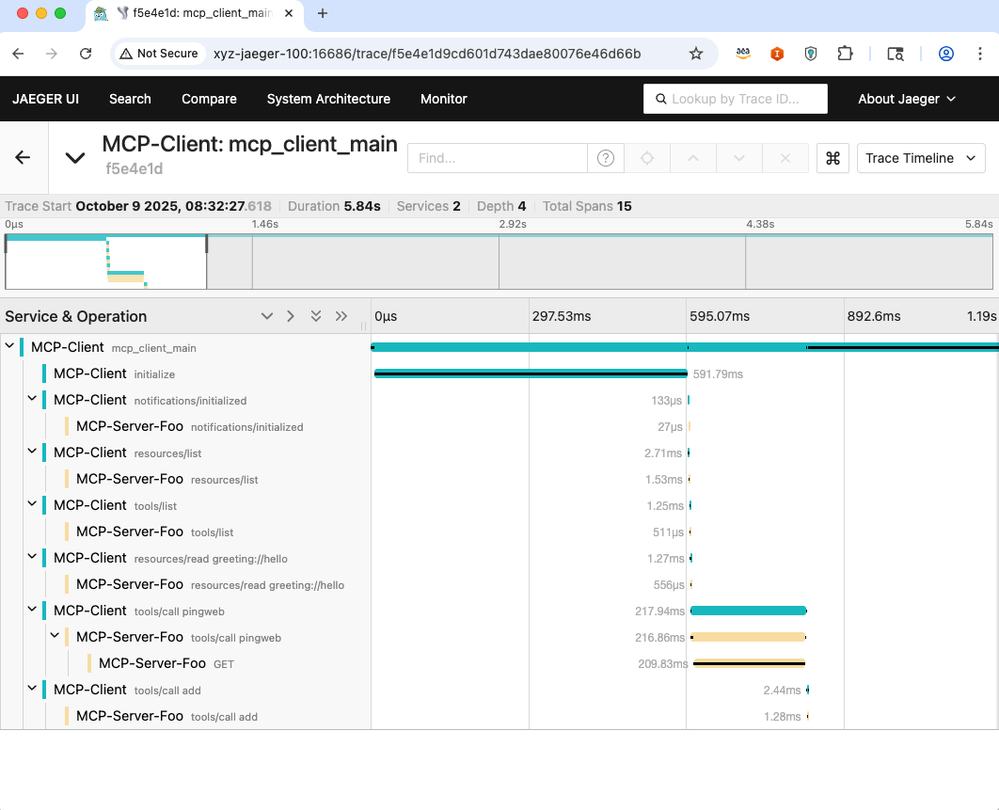

# MCP Client Example

## Setup

1. Install dependencies:
   ```sh
   uv sync
   uv run opentelemetry-bootstrap -a install
   uv run pip install -e /<Local Path>/opentelemetry-python-contrib/instrumentation-genai/opentelemetry-instrumentation-mcp
   ```

2. Run the client:
   ```sh
   OTEL_SERVICE_NAME=MCP-Client \
   OTEL_TRACES_EXPORTER=otlp \
   OTEL_EXPORTER_OTLP_TRACES_ENDPOINT=http://xyz-jaeger-100:4317/v1/traces \
   uv run opentelemetry-instrument python ./main.py
   ```

## Trace Output

