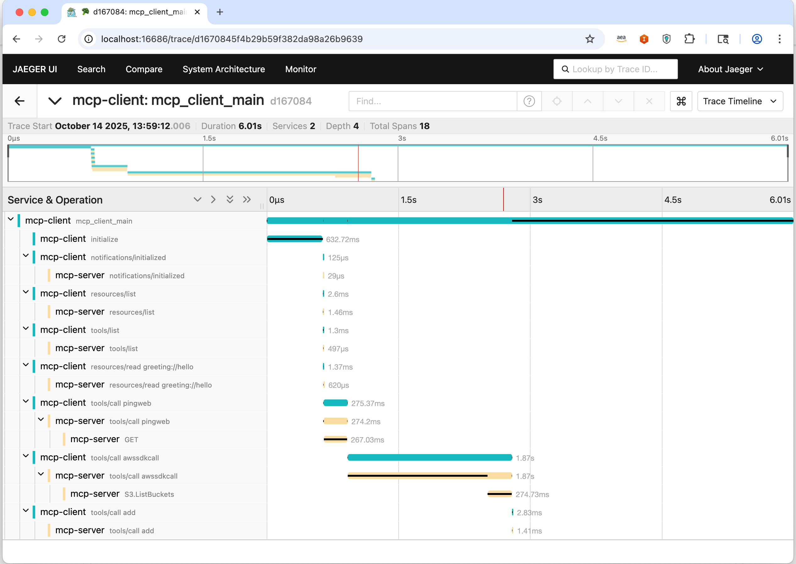

# MCP Client Example

## Setup

1. Install dependencies:
   ```sh
   uv sync
   uv run opentelemetry-bootstrap -a install

   # install MCP Instrumentation Library
   uv run pip install -e ../../../../opentelemetry-instrumentation-mcp 
   ```

2. Run the client:
   ```sh
   OTEL_SERVICE_NAME=mcp-client \
   OTEL_TRACES_EXPORTER=otlp \
   OTEL_EXPORTER_OTLP_TRACES_ENDPOINT=http://localhost:4317/v1/traces \
   uv run opentelemetry-instrument python ./main.py
   ```

## Trace Output

